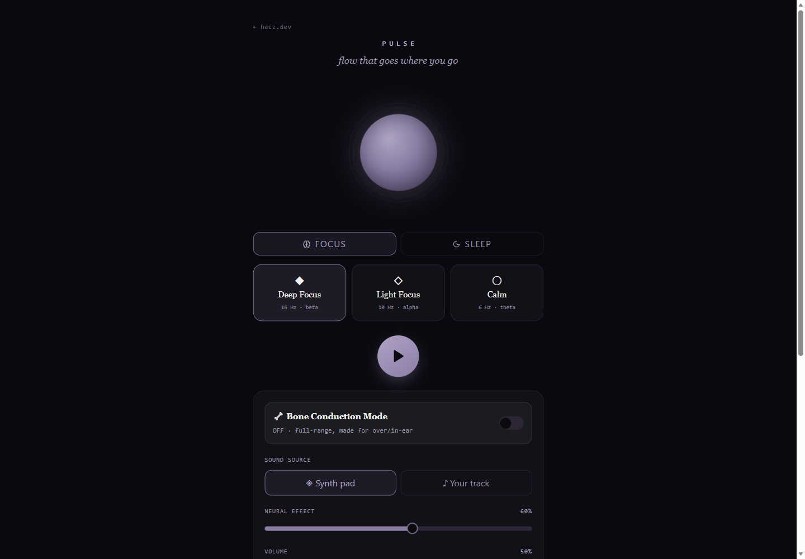

# Pulse

Pulse is a browser-based focus and sleep audio tool tuned for open-ear and bone-conduction headphones.

Live demos:

- GitHub Pages: [h3cz.github.io/pulse](https://h3cz.github.io/pulse/)
- Vercel: [pulse-public.vercel.app](https://pulse-public.vercel.app)

It uses the Web Audio API to generate an ambient synth pad or process your own local audio file, then applies amplitude modulation and an optional bone-conduction EQ curve. The goal is simple: keep the open-ear headphones on, stay reachable, and still get focus audio that feels full enough to use.



## Why I Built This

Open-ear headphones are great when you need to stay aware of your surroundings, but they can make focus audio sound thin. Pulse explores a browser-native way to improve that experience without paid infrastructure, native apps, or uploaded audio.

## Features

- Focus modes: Deep Focus, Light Focus, Calm
- Sleep mode with low-frequency delta modulation
- BYO audio file support; files stay local in the browser
- Synth pad fallback with generated tones and noise bed
- Bone Conduction Mode that trims bass and boosts the open-ear midrange
- Session timers and guided frequency arcs
- Browser media-session support for hardware play/pause keys
- Optional mini-player via Document Picture-in-Picture in supported browsers
- Reduced-motion support
- Unit tests for frequency and EQ math

## Tech Stack

| Layer | Technology |
|---|---|
| Frontend | React 18, TypeScript, Vite |
| Styling | Tailwind CSS, Radix UI primitives |
| Audio | Web Audio API |
| Tests | Vitest |

## Architecture

The audio graph lives outside React render state:

- `src/lib/pulse/engine.ts` owns the Web Audio graph.
- `src/hooks/useAudioEngine.ts` is a thin React lifecycle wrapper.
- `src/lib/pulse/states.ts` holds pure frequency and EQ math.
- `src/lib/pulse/programs.ts` defines timed session arcs.

This keeps slider changes imperative and avoids rebuilding the graph during normal UI renders.

## Local Setup

```bash
npm install
npm run dev
```

Build:

```bash
npm run build
```

Tests:

```bash
npm run test
```

## Security And Privacy

- Uploaded audio files are not sent to a server.
- The app works with no backend.
- The public build ships with no remote analytics.
- Pulse is a focus/wellness utility, not a medical device.

See [SECURITY.md](SECURITY.md).

## Roadmap

- Add screenshots and a short demo GIF.
- Optionally wire consent-based analytics in a fork.
- Add manual QA notes for browser audio behavior.
- Package a small reusable `PulseEngine` demo page.

## License

MIT
